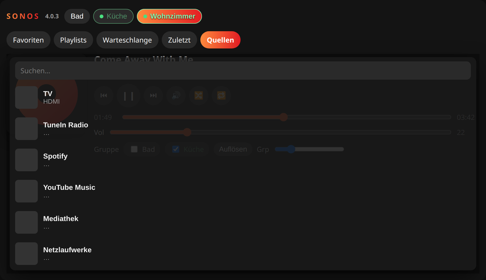
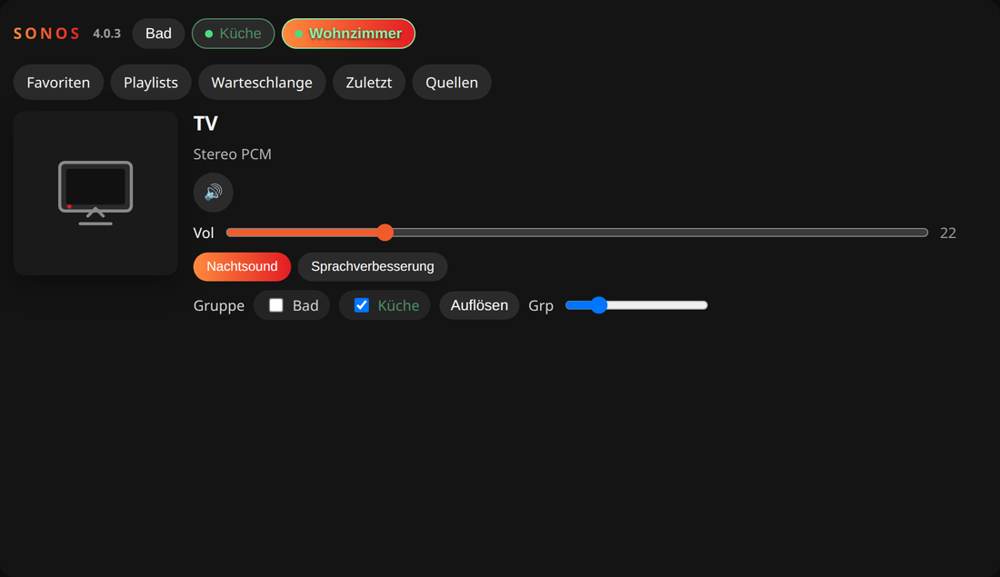

# ioBroker.sonos


[](https://www.npmjs.com/package/iobroker.sonos)


[](https://weblate.iobroker.net/engage/adapters/?utm_source=widget)
[](https://www.npmjs.com/package/iobroker.sonos)

Control and monitor SONOS devices with ioBroker.

## VIS widget

The adapter includes a VIS widget **Sonos Control**. One widget can switch rooms, control playback, form groups, and start favorites, playlists and queue tracks.

1. Install this adapter and make sure the **vis** adapter is running.
2. Restart **vis.0** (the adapter already asks vis to restart on install).
3. Reload the VIS editor with Ctrl+F5.
4. From the widget group **sonos**, drag **Sonos Control** onto a view.
5. Set the object to the instance, for example `sonos.0` — not a single `play` state.
6. Size the widget around **935 × 520**. In the widget settings choose a **theme**: `dark`, `light` (white) or `midnight`.

Eight **quick-start** buttons sit at the bottom. Tap an empty button to store what is playing (radio, favorite, track, TV HDMI). Tap a filled button to start it on the selected room. Long-press (or right-click) to rename, replace or clear. The same eight slots can be edited under **Quick start** in the adapter settings: click **Load current shortcuts**, edit, then save. Saving an empty table does not wipe buttons assigned in the widget.

After that, every discovered speaker appears as a chip at the top. Group membership is toggled with the checkboxes. If a room belongs to a group, the now-playing area shows the track of the group, not the last local title of that room. Library buttons under the rooms (**Favorites**, **Playlists**, **Queue**, **Recent**, **Sources**) open a slightly transparent sheet below the buttons. **Recent** lists the last tracks of the selected room. **Sources** browses TuneIn, Spotify, YouTube Music, the music library, network shares, line-in and TV HDMI. Spotify search uses the Sonos catalog. YouTube Music search lists catalog titles and tells the speaker to play them via `sid=284` (the official YTM account on the player). If a title does not start, save it as a favorite in the Sonos app.


*Rooms, grouping and now-playing*


*Library buttons open a slightly transparent sheet below the rooms*



*Sources including TV HDMI, TuneIn, Spotify and YouTube Music*



*TV HDMI: title TV, format, mute, night sound and speech enhancement*

To install this fork over the official adapter: in Admin open **Adapters** → GitHub button → `https://github.com/kosmix1980/ioBroker.sonos`, then restart vis and hard-reload the editor.

This branch includes the compiled `build/` folder so a GitHub install starts without compiling. ioBroker needs `build/main.js` as start file. After a GitHub install, if the log shows `cannot find start file`, compile once on the host:

```
cd /opt/iobroker/node_modules/iobroker.sonos
npm install
npm run build
iobroker restart sonos.0
```

## Handling of groups
* States for handling SONOS groups:
   * **`coordinator`**: set/get the coordinator, so the SONOS device which is the master and coordinating the group. It requires the IP address (channel name) of the SONOS device to be the coordinator, but with underscore `_` instead of dot `.`, so use for example `192_168_0_100` for IP address `192.168.0.100`. If the device does not belong to any group, then the value is equal to the own channel name (IP).
   * **`group_volume`**: the volume of the group
   * **`group_muted`**: mute status of the group.
   * **`add_to_group`**: Add a certain SONOS device to the SONOS device under which this state is. Use IP address with underscores (see above).
   * **`remove_from_group`**: Remove a certain SONOS device from the SONOS device under which this state is. Use IP address with underscores (see above).

*) These states will be updated if changes are made in the SONOS app.

## Using it with the sayIt adapter
To use the [sayit adapter](https://github.com/ioBroker/ioBroker.sayit) with this SONOS adapter, ensure that the [web adapter](https://github.com/ioBroker/ioBroker.web) is instantiated and running too. The web adapter is required to allow the SONOS adapter to read the generated MP3 file from the sayit adapter.

### Warning: Stability problems in combination with sayIt adapter
Please note: This SONOS adapter has stability issues if using 'text to speech' with the sayIt adapter. Symptoms observed:
1. Arbitrary change of volume to 0 or 100 %.
2. No response after a random number of text to speech sequences

Workaround for text to speech is to use the [SONOS HTTP API](https://github.com/jishi/node-sonos-http-api).

## Favorites & Queue in VIS
Use states `favorites_list_html` and `queue_html` to show playlists and current queue with basic html widget in VIS. By clicking on a row, the playlist or track will be played immediately.
Format the table with the following css classes:

### Favorites
* `sonosFavoriteTable`: hole favorite table
* `sonosFavoriteRow`: rows with favorite information
* `sonosFavoriteNumber`: Number of favorites
* `sonosFavoriteCover`: Album art of favorite (grab image with `.sonosFavoriteCover img`)
* `sonosFavoriteTitle`: Name of favorite

### Queue
* `.sonosQueueTable`: hole table
* `.sonosQueueRow`: rows containing track information
* `.currentTrack`: added to the row containg the current playing track
* `.sonosQueueTrackNumber`: Number or track
* `.sonosQueueTrackCover`: Album art of track (grab image with `.sonosQueueTrackCover img`)
* `.sonosQueueTrackArtist`: Name of artist
* `.sonosQueueTrackAlbum`: Name of album (use `display:none`if not needed)
* `.sonosQueueTrackTitle`: Name of title

For long lists add `overflow:auto;` or `overflow-y:auto;` to basic html widget.
Please note: highlighting current playing favorite is not supported.

### Sample CSS
```
.sonosFavoriteTable {
    color: #bbb;
    font-size: 12px;
}
.sonosFavoriteRow {
    cursor: pointer;
}
.sonosFavoriteNumber {}
.sonosFavoriteCover img {
    width: 30px;
    height: 30px;
}
.sonosFavoriteTitle {}

.sonosQueueTable {
    color: #bbb;
    font-size: 12px;
}
.sonosQueueRow {
    display: table-row;
    cursor: pointer;
}
.sonosQueueRow.currentTrack {
    color: #fff;
    font-weight: bold;
}
.sonosQueueTrackNumber {}
.sonosQueueTrackCover img {
    width: 30px;
    height: 30px;
    display: table-column;
}
.sonosQueueTrackArtist {
    display: table-row;
}
.sonosQueueTrackAlbum {
    display: none;
}
.sonosQueueTrackTitle {
    display: table-row;
}
```

## To Do
* Rewrite with https://github.com/svrooij/node-sonos-ts

## Configuration
- Web server - [optional] If web server enabled or not
- Update of elapsed time(ms) - Interval in ms how often to update elapsed timer when the title is playing. (Default 2000)

<!--
	Placeholder for the next version (at the beginning of the line):
	### **WORK IN PROGRESS**
-->
## Changelog
### **WORK IN PROGRESS**
* (kosmix1980) VIS widget: rooms, groups, favorites, playlists, queue, recent tracks and sources
* (kosmix1980) Sources: TuneIn, library, shares, line-in, Spotify/SMAPI search, YouTube Music catalog (sid=284, no stream proxy)
* (kosmix1980) TV HDMI as a playable source with format, cover, night sound and speech enhancement
* (kosmix1980) Library buttons open a slightly transparent popup below the buttons
* (kosmix1980) Added `playlist_list` / `playlist_list_array` and per-room `recent_tracks`
* (kosmix1980) Group members follow the coordinator's now-playing and transport
* (kosmix1980) VIS widget: eight quick-start buttons with station/album logos; edit in the widget or under adapter settings
* (kosmix1980) VIS widget: show playlist covers; restore album art for tracks after leaving radio
* (kosmix1980) VIS widget: dark / light / midnight themes; default width 935 px
* (kosmix1980) VIS widget: thicker seek, volume and group-volume sliders
* (kosmix1980) Update the now-playing cover for TuneIn radio (metadata / station logo, no stale image)
* (kosmix1980) VIS widget: hide the seek bar while radio is playing; show it again for playlists and tracks
* (kosmix1980) Replay TuneIn from Recent with the station URI and metadata; keep recent covers unique
* (kosmix1980) Repair older Recent rows that still pointed at the live now-playing cover
* (kosmix1980) After grouping or ungrouping a home-theater room (Arc + surrounds), unmute the rear speakers again
* (kosmix1980) Playing a song from Recent updates title, artist, cover and the seek bar; track covers stay in the list
* (kosmix1980) VIS widget: stop the kiosk reload loop by not rebuilding the page on every Sonos poll

### 4.0.3 (2026-08-13)
* (@GermanBluefox) Fixed TTS: without a volume in the file name, the announcement was played with volume 0
* (@GermanBluefox) Fixed the immediate stop of TTS: the state before TTS was not restored and TTS stayed blocked
* (@GermanBluefox) A muted player is unmuted now for the announcement and muted again afterwards
* (@GermanBluefox) An empty value in the `tts` state stops the running announcement
* (@GermanBluefox) The adapter was migrated to TypeScript and is now based on classes
* (@GermanBluefox) The "root" device object is created now by js-controller from io-package.json
* (biglouis) Missing states of the already existing devices will be created at start
* (VierlingMt) Fixed the error if `favorites_set` was called with an empty value
* (seb2010) Added support for treble and bass information
* (Apollon77) stores the tts files in files instead of binary states

### 3.0.0 (2023-10-09)
* (udondan) Added support for the playing Sonos playlists (added new state `playlist_set`)
* (bluefox) The minimal node.js version is 16

### 2.3.3 (2023-09-21)
* (foxriver76) fixed cover url

### 2.3.2 (2023-09-20)
* (foxriver76) stores the cover file in files instead of binary states

### 2.3.1 (2023-03-22)
* (Apollon77) Prepare for future js-controller versions

## License

The MIT License (MIT)

Copyright (c) 2014-2026, bluefox <dogafox@gmail.com>

Permission is hereby granted, free of charge, to any person obtaining a copy
of this software and associated documentation files (the "Software"), to deal
in the Software without restriction, including without limitation the rights
to use, copy, modify, merge, publish, distribute, sublicense, and/or sell
copies of the Software, and to permit persons to whom the Software is
furnished to do so, subject to the following conditions:

The above copyright notice and this permission notice shall be included in
all copies or substantial portions of the Software.

THE SOFTWARE IS PROVIDED "AS IS", WITHOUT WARRANTY OF ANY KIND, EXPRESS OR
IMPLIED, INCLUDING BUT NOT LIMITED TO THE WARRANTIES OF MERCHANTABILITY,
FITNESS FOR A PARTICULAR PURPOSE AND NONINFRINGEMENT. IN NO EVENT SHALL THE
AUTHORS OR COPYRIGHT HOLDERS BE LIABLE FOR ANY CLAIM, DAMAGES OR OTHER
LIABILITY, WHETHER IN AN ACTION OF CONTRACT, TORT OR OTHERWISE, ARISING FROM,
OUT OF OR IN CONNECTION WITH THE SOFTWARE OR THE USE OR OTHER DEALINGS IN
THE SOFTWARE.
